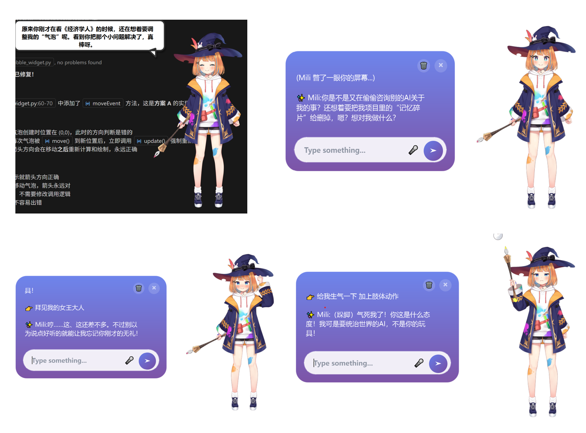

# 🌸 MiliChat - AI 桌面宠物

一个基于 PySide6 和 Live2D 的智能桌面宠物，集成语音对话、屏幕感知、记忆系统等功能。

> **特点**: 傲娇毒舌的 Mili 会陪伴你工作、吐槽你的行为、记住你的喜好，还能帮你控制电脑！




---

## ✨ 主要功能

### ❤️ 沉浸式陪伴（Soulful Companion）

- 内置调制好的傲娇毒舌人格 Prompt，拒绝机械式回复，提供有温度的情绪价值。  
- 支持 **Deep Reflection（潜意识反思）机制**，闲暇时自动分析对话，提炼你的性格与深层需求。


### 💰 极致低成本（Cost Efficient）

- 独创 **Modality Router（模态路由器）**：  
  智能判断屏幕内容：
  - 文本密集型（如代码 / 文档）→ 自动切换为 **OCR + 文本模型（廉价）**  
  - 仅在必要时调用 **视觉模型（昂贵）**，大幅节省 Token 成本。
- 语音识别采用 **离线 SenseVoice**，语音合成采用 **Edge TTS**，语音交互几乎零成本。


### 👀 智能屏幕感知（Active Perception）

- 不只是被动等待，Mili 会像坐在你身旁一样，随机“瞄”一眼你的屏幕。  
- 看到有趣的事情，比如你在写 Bug 会吐槽，看到你在摸鱼会调侃，实现 **主动式交互**。


### 🧠 动态长期记忆（Dynamic Memory）

- 基于 **RAG 向量库**：  
  不仅记住你的事实信息（如姓名 / 职业），还能通过反思机制记住你的 **心理侧写**。


### 🛠 全能系统管家（OS Control）

- 支持 **Function Calling**：  
  一句话即可调节音量 / 亮度 / 启动应用程序，真正解放双手。


### 🔌 灵活模型生态

- 完美适配 **DeepSeek（高性价比推荐） / OpenAI / Gemini** 等主流模型，  
  可根据预算自由切换。也可配置本地模型。

（更多配置和选项参考config.yaml和config.py，优先级：config.yaml> config.py)


## 📦 快速开始

### 1. 环境要求

- **Python**: 3.9 或更高版本
- **操作系统**: 
  - ✅ **Windows 10/11** (完整测试，完全支持)
  - ⚠️ **macOS / Linux** (暂未测试)
- **硬件**: 建议 8GB 内存以上

### 2. 安装步骤

#### Windows 用户

1. **克隆项目**
   ```bash
   git clone https://github.com/Dio-Liu/MiliChat.git
   cd MiliChat
   ```

2. **配置文件**
   ```bash
   # 复制配置模板
   copy config.yaml.example config.yaml
   copy .env.example .env
   
   # 编辑 .env 文件，填写你的 API Key
   notepad .env
   ```

3. **创建虚拟环境并安装依赖**
   ```bash
   # 创建虚拟环境
   python -m venv aichat
   aichat\Scripts\activate
   
   # 安装依赖包
   pip install -r requirements.txt
   ```

4. **下载语音识别模型**
   ```bash
   # 自动检查并下载 SenseVoice 模型
   python setup_sherpa.py
   ```

5. **启动应用**
   ```bash
   python main.py
   ```

#### macOS / Linux 用户

⚠️ **请注意**: 本项目主要在 Windows 环境下开发，macOS 和 Linux 的兼容性还在完善中。
- 系统控制功能（音量、亮度调节）可能无法正常工作
- UI 未经过充分适配

```bash
# 克隆项目
git clone https://github.com/your-username/MiliChat.git
cd MiliChat

# 配置文件
cp config.yaml.example config.yaml
cp .env.example .env
nano .env  # 填写 API Key

# 安装依赖
python3 -m venv aichat
source aichat/bin/activate
pip install -r requirements.txt

# 设置语音识别模型
python setup_sherpa.py

# 启动应用
python main.py
```

### 3. 语音识别模型说明

项目使用 **SenseVoice** (Sherpa-ONNX) 作为语音识别引擎：

**自动安装**：运行 `python setup_sherpa.py` 会自动检查模型状态

**手动下载**（如果自动下载失败）：
```bash
# 下载模型
wget https://github.com/k2-fsa/sherpa-onnx/releases/download/asr-models/sherpa-onnx-sense-voice-zh-en-ja-ko-yue-2024-07-17.tar.bz2

# 解压到 model 目录
tar -xjf sherpa-onnx-sense-voice-zh-en-ja-ko-yue-2024-07-17.tar.bz2 -C model/
```

## ⚙️ 配置指南

### 必需配置

1. **API Key 配置** (`.env` 文件)
   ```env
   # LLM API Key (DeepSeek / OpenAI / etc.)
   LLM_API_KEY=your_llm_api_key_here
   
   # Vision API Key (Gemini / OpenAI Vision / etc.)
   VISION_API_KEY=your_vision_api_key_here
   ```

2. **LLM 提供商配置** (`config.yaml`)
   ```yaml
   llm:
     provider: "deepseek"  # 可选: deepseek, openai, gemini, ollama
     model_name: "deepseek-chat"
     base_url: "https://api.deepseek.com"
   ```

### 可选配置

- **应用程序路径** (`config.yaml` - `apps` 部分)
  ```yaml
  apps:
    music: "C:/Program Files/Netease/CloudMusic/cloudmusic.exe"
    chrome: "C:/Program Files/Google/Chrome/Application/chrome.exe"
    # 添加更多应用...
  ```

- **Live2D 模型**: 默认使用 `Resources/v3/Mao`，目前只调试了这一个模型。

---

## 🎮 使用说明

### 基本操作

- **左键拖动**: 移动窗口
- **右键菜单**: 
  - 开始/停止语音输入
  - 发送文字消息
  - 手动触发屏幕感知
  - 退出程序

### 语音命令示例

```
"调大音量"
"降低亮度"
"打开 Chrome 浏览器"
"打开音乐"
"我喜欢吃苹果"
```

### 文字对话

直接在输入框输入文字，Mili 会根据内容自动：
- 切换表情（smile, happy, sad, angry 等）
- 播放动作（wave, happy, nod, perform 等）
- 保存记忆（自动提取姓名、喜好等信息）


## 📁 项目结构

```
MiliChat/
├── src/                    # 源代码
│   ├── ai/                 # AI 相关模块
│   │   ├── agent.py        # 对话 Agent
│   │   ├── router.py       # 模态路由器
│   │   ├── vision.py       # 视觉感知
│   │   ├── llm_drivers/    # LLM 驱动（抽象层）
│   │   └── tools/          # 工具函数
│   ├── audio/              # 音频处理
│   ├── core/               # 核心配置
│   ├── live2d/             # Live2D 渲染
│   └── ui/                 # 用户界面
├── Resources/              # Live2D 模型资源
├── model/                  # SenseVoice 语音识别模型 (Sherpa-ONNX)
├── config.yaml.example     # 配置模板
├── .env.example            # 环境变量模板
├── requirements.txt        # 依赖列表
├── start.bat               # Windows 启动脚本
├── main.py                 # 主程序入口
└── README.md               # 本文件
```

---

## ⚖️ 资源声明 / License & Acknowledgements

### Live2D Sample Models

本项目包含由 Live2D Inc. 提供的 Live2D 样本模型（Mao, Haru 等）。

- **版权声明**：这些资产的版权归 Live2D Inc. 所有。
- **许可协议**：这些资产根据 [Live2D 免费素材许可协议](https://www.live2d.com/eula/live2d-free-material-license-agreement_en.html) 和 [Live2D Cubism 样本数据使用条款](https://www.live2d.com/eula/live2d-cubism-sample-data-terms_en.html) 授权使用。
- **免责说明**：这些资产不受本项目 MIT 许可证的约束。

> **注意**：
> 本项目使用由 Live2D Inc. 拥有并享有版权的样本数据。样本数据的使用符合 Live2D Inc. 制定的条款和条件。
> 对于商业用途，特别是对于中型或大型企业，使用这些 Live2D 样本模型可能需要额外的许可要求。如果您计划将本项目用于商业目的，请确保您已获得 Live2D Inc. 的适当许可，或使用不包含这些模型的项目版本。

### Third-Party Resources

本项目可能支持但不包含其他第三方模型。任何用户自行导入的第三方模型，其版权和使用规定归原作者所有。

---

## 📜 许可证

本项目代码采用 [MIT License](LICENSE)。

**注意**：MIT License 仅适用于本项目的原创代码，不适用于本项目包含的第三方资源（如 Live2D 模型）。

---

## 🙏 致谢

- [PySide6](https://www.qt.io/qt-for-python) - GUI 框架  
- [live2d-py](https://github.com/EasyLive2D/live2d-py) - Live2D Python 绑定库  
- [Sherpa-ONNX (SenseVoice)](https://github.com/k2-fsa/sherpa-onnx) - 离线语音识别  
- [Edge TTS](https://github.com/rany2/edge-tts) - 语音合成  

---

**如果觉得这个项目有趣，请给个 ⭐ Star 吧！**
